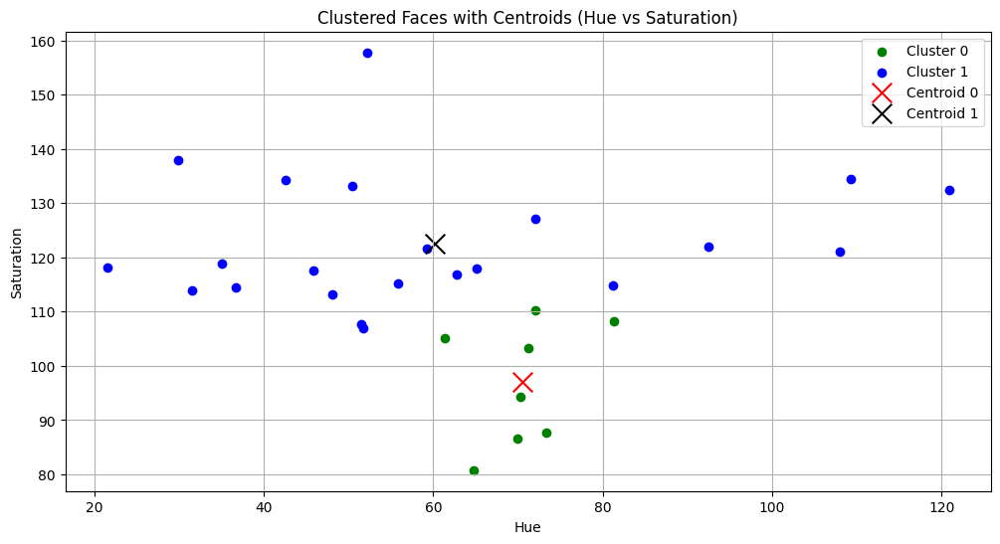
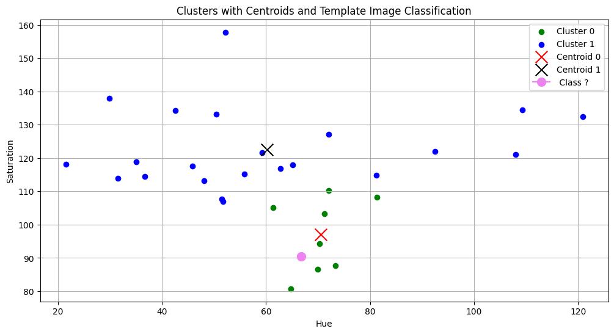

# Face Detection and Clustering using K-Means

## Aim

The aim of this project is to detect faces from an image and cluster them using K-Means clustering based on Hue and Saturation features extracted from HSV color space.

---

## Face Detection Result

Below image shows detected faces:

---

## Cluster Visualization

This graph shows clustered faces and centroids:

---

## Template Image Classification

This graph shows classification of template image:

---

## Methodology

Steps followed:

1. Load image using OpenCV
2. Detect faces using Haar Cascade Classifier
3. Extract Hue and Saturation features
4. Apply K-Means clustering
5. Plot clusters and centroids
6. Classify template image

---

## Key Findings

• Faces were successfully detected  
• K-Means correctly clustered faces  
• Template image was correctly classified  
• HSV features worked well for clustering  

---

## Conclusion

K-Means clustering can successfully group faces based on visual similarity using HSV color features.

---

## Technologies Used

Python  
OpenCV  
NumPy  
Matplotlib  
Scikit-Learn  

---

## Author

Ishita Sapra  
Spring 2026
